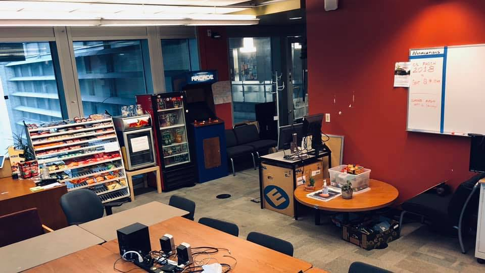

The Computer Science Student Union, or CSSU for short, represents over 1200 Computer Science students who are either taking a Computer Science course or are part of a Computer Science POSt at the University of Toronto St. George campus. We are a student governed body that receives funding from the Arts and Sciences' Student Union, the Department of Computer Science, and our union store. The description of the structure, rules, and processes of the union are described in our [**constitution**](https://drive.google.com/file/d/1BtoaF5GL-9pxtXPqgN0domckNSJyOE3V/view?usp=sharing).

---

# Mission Statement

The primary goal for the CSSU team is to improve the academic, social, and professional lives of computer science students. To do so, we intend to focus on the following:

- **Social Activities**: organize social events to help students in making friends in their program and form networks of mutual support.
- **Professional Development**: provide students with networking and professional skill development opportunities students to facilitate success in their careers.
- **Academic Opportunities**: present adequate resources and opportunities to help them embed themselves in the world of academic computer science and share their work with their peers.
- **Undergrad and Department Liaison**: assist students in studies and advocate for their interests at a departmental, faculty, and university level.

---

# Our Lounge @ BA 2250

The CSSU proudly maintains a student lounge in which students can hang out, network, play games and ask questions. Office operations volunteers manage the lounge, store, and help answer questions about the undergraduate student experience. A sign-up form will be posted soon to schedule weekly office hours. Check back soon!

_The lounge is currently closed due to COVID-19 public health guidelines. We expect to reopen in late-September._

## Store

We sell many food items in our in-lounge store for your convenience. Anyone can come by during open hours and purchase a snack or beverage using cash or card (for purchases of $1 or more). Please be kind to the person assisting you with your purchase at the desk; they are a volunteer!

---

## Feedback Form

At the CSSU, we strive to represent Computer Science students as best as possible, and to create an inclusive and welcoming community. As part of this effort, we are committed to listening to the feedback of CSSU members. Using this always-open form, you can submit feedback to us about any aspect of our activities, past or present. If you would like, you can provide your name or contact email so we can follow up with you directly. You may also remain anonymous. All feedback is welcome! [**CSSU Feedback Form**](https://forms.gle/bb4JXfWYkqW7Ewhh8)
