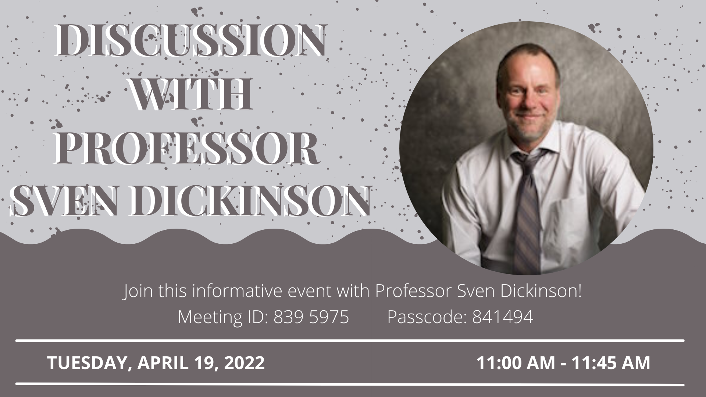

The CSSU is hosting a discussion with Professor Sven Dickinson! Join us to hear more about his career and research, and for an opportunity to ask some questions! [Sign up!](https://forms.gle/Z9pacq8Gp9siBpTk9)

- Location: [Zoom](https://utoronto.zoom.us/j/8395975) (passcode: 841494)
- Time: 11:00-11:45AM on Tuesday, April 19, 2022.

---

Sven Dickinson received the B.A.Sc. degree in Systems Design Engineering from the University of Waterloo, in 1983, and the M.S. and Ph.D. degrees in Computer Science from the University of Maryland, in 1988 and 1991, respectively. He is Professor and past Chair of the Department of Computer Science at the University of Toronto, and is also Vice President and Head of the new Samsung Toronto AI Research Center, which opened in May, 2018. Prior to that, he was a faculty member at Rutgers University where he held a joint appointment between the Department of Computer Science and the Rutgers Center for Cognitive Science (RuCCS). His research research interests revolve around the problem of shape perception in computer vision and, more recently, human vision. He has received the National Science Foundation CAREER award, the Government of Ontario Premiere's Research Excellence Award (PREA), and the Lifetime Research Achievement Award from the Canadian Image Processing and Pattern Recognition Society (CIPPRS). He was the Editor-in-Chief of the IEEE Transactions on Pattern Analysis and Machine Intelligence, from 2017-2021, currently serves on seven editorial boards, and is co-editor of the Morgan & Claypool Synthesis Lectures on Computer Vision. He is a Fellow of the International Association for Pattern Recognition (IAPR).
