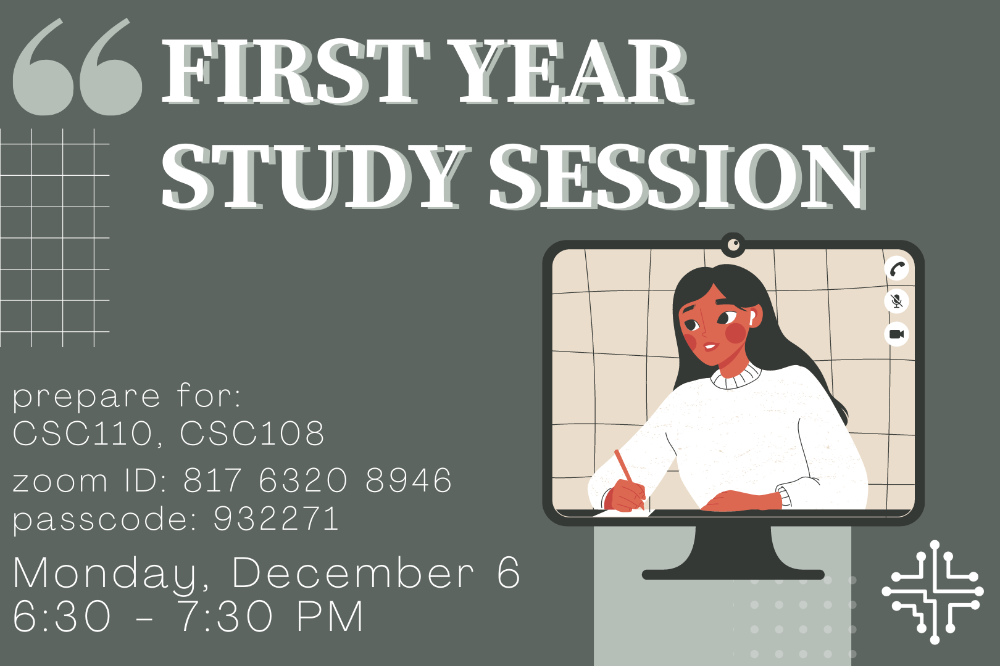

In preparation for exam season, we are planning some last-minute study sessions with some TAs/upper-year students. We would love to have your input on what CSC courses (at the St. George campus) you would like to see study sessions for, when you would like to have them, and anything you'd like to see. Please fill out the **[Google form](https://forms.gle/MBhzFx1f3YBkqEsh6)** to let us know!

---

## [CSC110Y1](https://artsci.calendar.utoronto.ca/course/csc110y1)/[108H1](https://artsci.calendar.utoronto.ca/course/csc108h1) - December 6th, 2021

- December 6th, 6:30PM Eastern
- [Zoom](https://utoronto.zoom.us/j/81763208946) (passcode: `932271`)

---

## [CSC207H1](https://artsci.calendar.utoronto.ca/course/csc207h1)/[236H1](https://artsci.calendar.utoronto.ca/course/csc236h1) - December 13th, 2021

- December 13th, 2:00-2:45PM Eastern (CSC207)
- December 13th, 2:45-3:30PM Eastern (CSC236)
- [Zoom](https://utoronto.zoom.us/j/81763208946) (passcode: `932271`)

---
