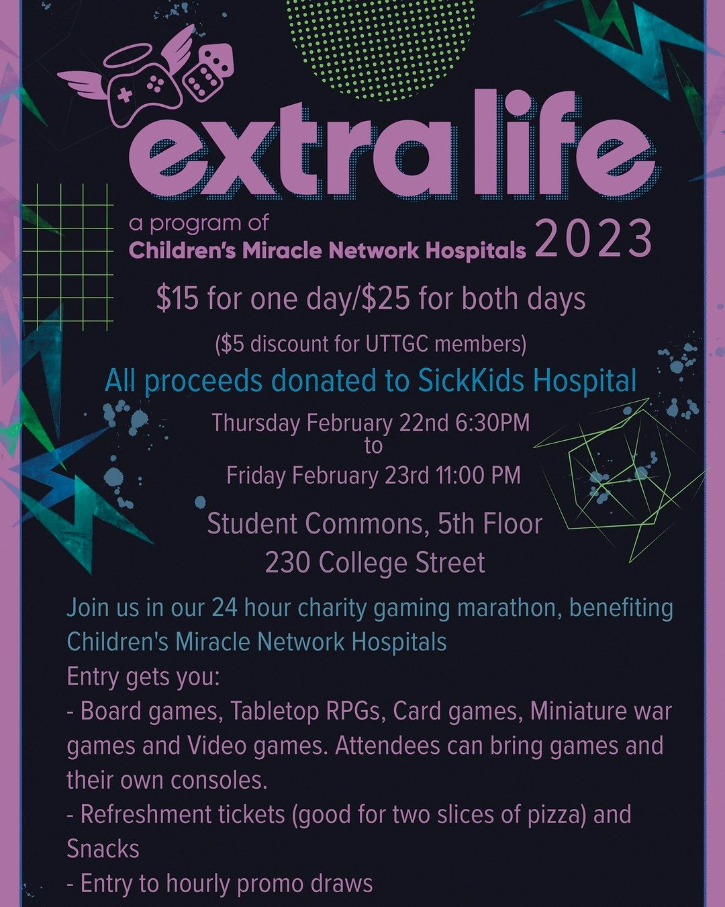

## Details

- **When: February 22nd 6:30pm ~ February 23rd 11:00pm**
- **Where: Student Commons, 5th floor ([230 College Street](https://www.google.com/maps/place/Architecture+Bldg,+230+College+St,+Toronto,+ON+M5T+1R2/@43.6588125,-79.3983357,18.5z/data=!4m6!3m5!1s0x882b34c0c6017a5d:0x9d72751ff0a183b3!8m2!3d43.6587516!4d-79.3979178!16s%2Fg%2F12hpp452v?entry=ttu))**
- **Admission: $15 for one day, $25 for both days (UTTGC members get a $5 discount)**

UTTGC and the CSSU are running *Extra Life*, a 24-hour charity gaming marathon. All proceeds are donated to SickKids Hospital. Come join us at the Student Commons for games, food, and a chance to win in hourly promo draws!

---