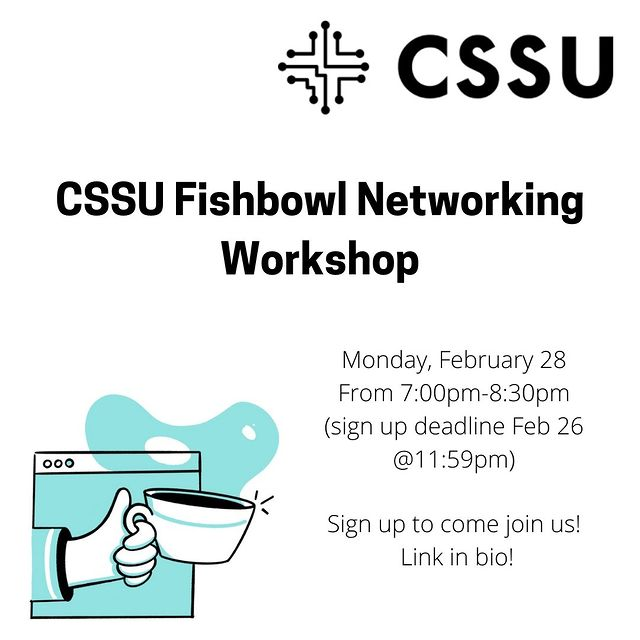

---

Hi everyone!

We present the CSSU Fishbowl Networking Workshop! Practice, and perfect your networking skills. (This event is meant for both beginners and pros). Practice networking with experts from Google, Facebook, Salesforce, NASA, AppSec, and more! Networking is extremely useful for your career. Whether during career fairs, job interviews, coffee chats, or occasional meetings with new people, having a good grasp on some networking skills can get you new professional opportunities and open many doors. Beyond that, getting good at networking leads to transferable skills in communication, self confidence, good question asking, and more.

**[Sign up (by Feb 26 @11:59pm)](https://forms.gle/rbnGwCZp9eLjgKur6)** to join us on Monday, February 28 From 7:00pm-8:30pm.

Sign up here: https://forms.gle/rbnGwCZp9eLjgKur6
