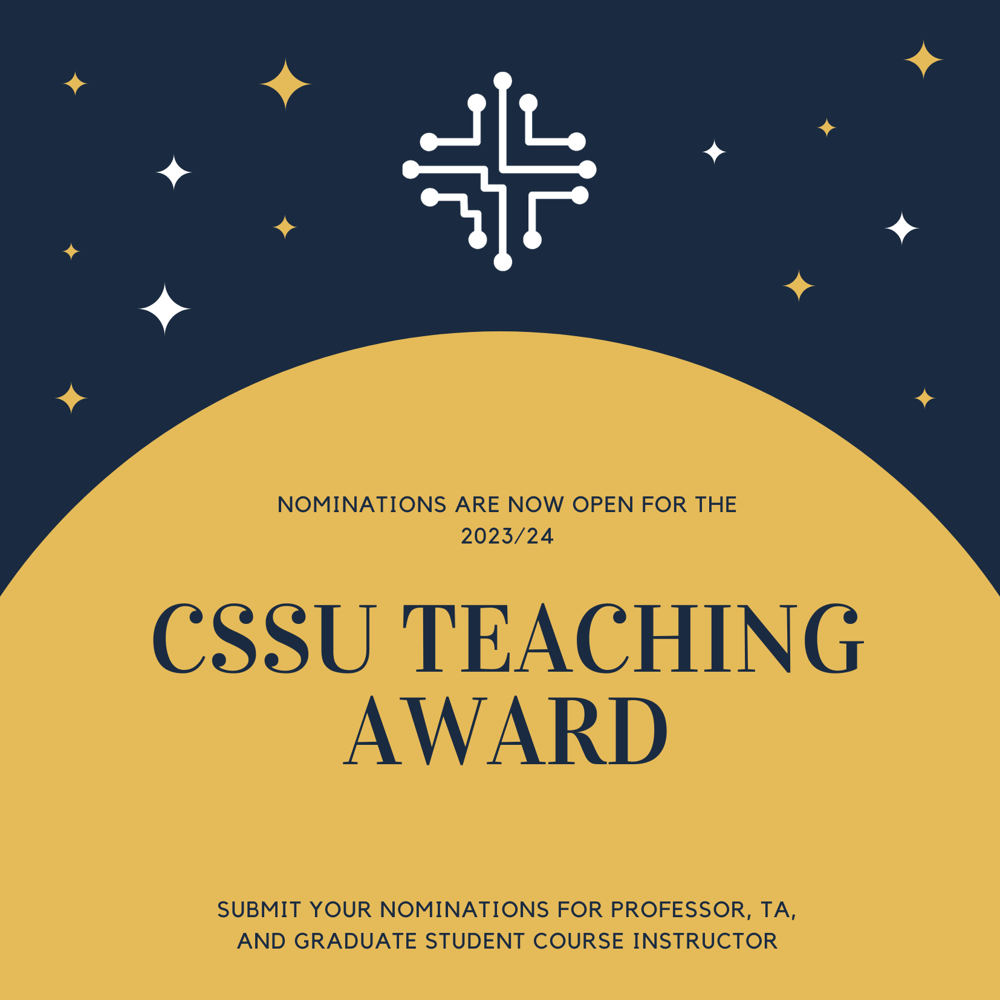

## Details

- Nominations are open until **Wednesday April 3rd, 2024**.
- You can find the nomination form **[here](https://forms.gle/oWyWwmXUoz8LkTUo6)**.

We are bringing back the CSSU teaching awards!

Feel free to nominate a professor, a graduate student course instructor, and/or teaching assistant (TA) who has enriched your learning
experience in the 2023/2024 fall-winter session! There will be two to three winners for each category, and they
will be recognized with our CSSU professor, graduate student course instructor, and TA teaching awards.

The final decisions will be made by the CSSU Academic Affairs committee based on the input you provide, but not necessarily the quantity of nominations.

